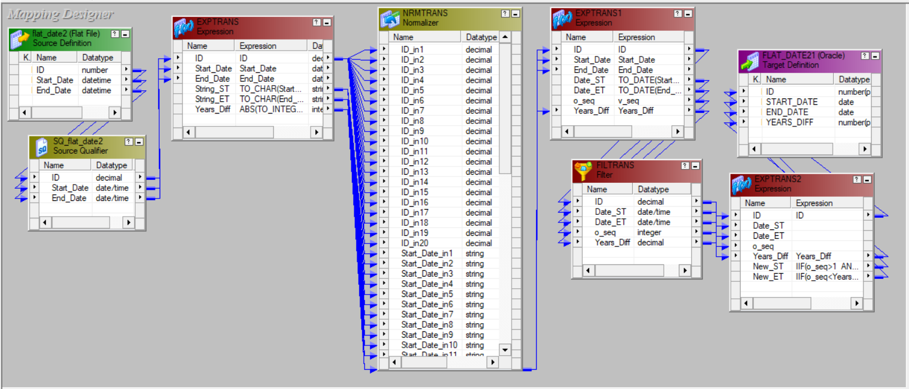
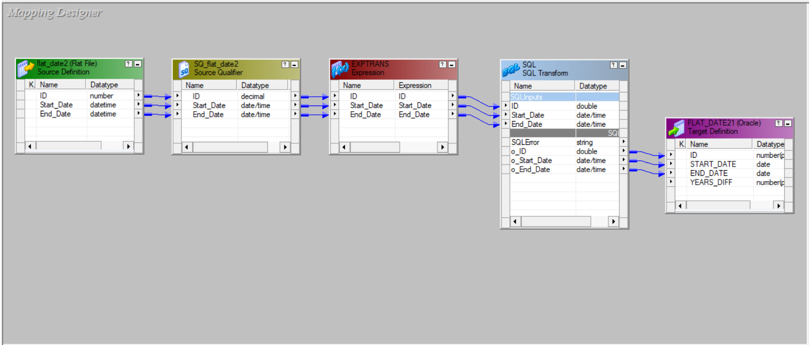
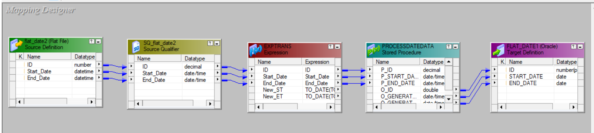
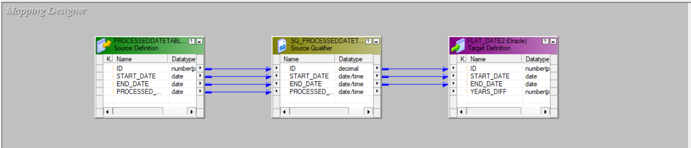

# Informatica Date Range Split

## Overview
This repository demonstrates multiple approaches to transforming date ranges into yearly records using **Informatica PowerCenter**. The solution takes an input file containing `ID, Start_Date, End_Date` and generates records by breaking the date range into yearly segments.

## Input File Format
Example:
```
ID,Start_Date,End_Date
106,02/21/2022,05/15/2025
```

## Expected Output Format
Example:
```
106    21-FEB-22    31-DEC-22
106    01-JAN-23    31-DEC-23
106    01-JAN-24    31-DEC-24
106    01-JAN-25    15-MAY-25
```
## **Approaches Implemented**  

This repository demonstrates three different approaches to transforming date ranges into yearly records using **Informatica PowerCenter**. Each approach varies in implementation, leveraging different components to generate and process the required records efficiently.  

### 1. Normalizer Approach

#### *Overview*
This document explains the Normalizer approach used to split date ranges in an Informatica mapping. The approach involves various transformations to achieve the required data transformation while handling limitations.

#### *Pipeline Flow*


#### *Step-by-Step Transformation Details*

1. **Source Definition (flat_date2 - Flat File)**
   - Reads input data from a flat file.
   - Ensure to configure the file source properties correctly, specifying the `date format` used in the input file.

2. **Source Qualifier (SQ_flat_date2)**
   - Converts the source data into native Informatica data types.

3. **First Expression Transformation (EXPTRANS)**
   - Converts `Start_Date` and `End_Date` fields from date to string format since the Normalizer transformation does not accept date types.
   - Calculates the difference in years between `Start_Date` and `End_Date` using an expression.
     
     ```
     # Years Difference
     ABS(TO_INTEGER(TO_CHAR(Start_Date,'YYYY'))-TO_INTEGER(TO_CHAR(End_Date,'YYYY')))
     ```

4. **Normalizer Transformation (NRMTRANS)**
   - Uses the **occurrence** property to generate multiple records.
   - **Limitation:** If the occurrence is set to 50 and the `Years_Diff` is more than or equal to 50, this approach will not handle the excess records.

5. **Second Expression Transformation (EXPTRANS1)**
   - Converts `Start_Date` and `End_Date` back to date format from string.
   - Generates a sequence number for each record.
  
     ```
     # Squence Number (v_Seq)
     IIF(ID=previous_ID,v_seq+1,1)
     ```

6. **Filter Transformation (FILTRANS)**
   - Filters out unnecessary records based on the `Years_Diff` value, keeping only the required rows for further processing.

     ```
     # Filter Condition
     o_seq<=Years_Diff+1
     ```

7. **Third Expression Transformation (EXPTRANS2)**
   - Transforms the `New_Start` and `New_End` dates as per the required logic.

     ```
     # New Start Date
     IIF(o_seq>1  AND o_seq<=Years_Diff+1,TRUNC(ADD_TO_DATE(Date_ST,'YYYY',o_seq-1),'YYYY'),Date_ST)

     # New End Date
     IIF(o_seq<Years_Diff+1,LAST_DAY(ADD_TO_DATE(TRUNC(ADD_TO_DATE(Date_ST,'YYYY',o_seq-1),'YYYY'),'MM',11)),Date_ET)
     ```

8. **Target Definition (FLAT_DATE21 - Oracle)**
   - The final processed records are written to the target table.

#### *Key Considerations*
- **Normalizer Limitation:** The occurrence value must be carefully chosen to avoid losing records with `Years_Diff` exceeding the threshold.
- **Date Handling:** String conversion of date fields is necessary before and after the Normalizer transformation to maintain proper data format.
- **Filtering Logic:** Ensure the filter transformation retains only the necessary records to optimize performance and avoid unnecessary data processing.


### 2. SQL Transformation Approach  

#### *Overview*  
This approach utilizes an **SQL transformation** to split date ranges into multiple records dynamically. The transformation leverages a **recursive SQL query** to generate new records while modifying the start and end dates accordingly.  

#### *Pipeline Flow*


#### *Workflow*  
1. **Source Definition:** Reads data from the source, which includes ID, Start Date, and End Date.  
2. **Source Qualifier:** Passes the source data downstream.  
3. **Expression Transformation:** Transfers values to ensure compatibility with the SQL transformation.  
4. **SQL Transformation:**  
   - Processes the input using an **SQL query** to generate new records.  
   - Dynamically calculates new Start and End dates based on yearly intervals.  
5. **Target Definition:** Writes the transformed records into the target table.  

### *SQL Query Used in SQL Transformation*  
   ```sql
   SELECT o_ID, o_Start_Date, o_End_Date 
   FROM (
       SELECT 
           ID AS o_ID,
           CASE 
               WHEN LEVEL = 1 THEN Start_Date 
               ELSE TRUNC(Start_Date, 'YYYY') + (LEVEL - 1) * INTERVAL '1' YEAR 
           END AS o_Start_Date,
           CASE 
               WHEN EXTRACT(YEAR FROM (TRUNC(Start_Date, 'YYYY') + (LEVEL - 1) * INTERVAL '1' YEAR)) = 
                    EXTRACT(YEAR FROM End_Date) 
               THEN End_Date 
               ELSE TO_DATE('12/31/' || EXTRACT(YEAR FROM (TRUNC(Start_Date, 'YYYY') + (LEVEL - 1) * INTERVAL '1' YEAR)), 'MM/DD/YYYY') 
           END AS o_End_Date
       FROM (SELECT ?ID? AS ID, ?Start_Date? AS Start_Date, ?End_Date? AS End_Date FROM DUAL)
       CONNECT BY TRUNC(Start_Date, 'YYYY') + (LEVEL - 1) * INTERVAL '1' YEAR <= TRUNC(End_Date, 'YYYY')
   );
   ```  

#### **Key Highlights**  
- Uses **CONNECT BY LEVEL** to create multiple records per input row.  
- **CASE statements** dynamically adjust Start and End dates.  


### Stored Procedure Approach

#### *Overview*  
This approach utilizes a **stored procedure** to process date ranges efficiently. The procedure dynamically **splits the date range** into multiple records using a **loop-based mechanism** and inserts the generated data into a temporary table in the target database. The process consists of two flows:  
1. **Flow 1:** Reads data from a source file and passes it to the stored procedure, which processes and inserts records into a temporary table.  
2. **Flow 2:** Reads processed records from the temporary table and loads them into the final target table.  

#### *Workflow* 

#### *Flow 1: Data Ingestion & Processing*



1. **Source Definition:** Reads data from a source file containing ID, Start Date, and End Date.  
2. **Source Qualifier:** Passes the data downstream.  
3. **Stored Procedure Transformation:**  
   - Calls a **stored procedure** that:  
     - Iterates through the years between the Start and End Dates.  
     - Generates new records with the appropriate Start and End Dates.  
     - Inserts processed records into a temporary table.  

#### *Flow 2: Final Data Load*  



1. **Source Definition:** Reads data from the temporary table in the database.  
2. **Source Qualifier:** Passes the processed data downstream.  
3. **Target Definition:** Writes the transformed records into the final table.  

### *Stored Procedure for Processing Date Data*  
```sql
CREATE OR REPLACE PROCEDURE ProcessDateData (
    p_id IN NUMBER, 
    p_start_date IN DATE, 
    p_end_date IN DATE, 
    o_id OUT NUMBER, 
    o_generated_start_date OUT DATE, 
    o_generated_end_date OUT DATE
)
IS
    v_year_value NUMBER;
    v_start_date DATE;
    v_end_date DATE;
BEGIN
    -- Initialize variables
    v_start_date := p_start_date;
    v_year_value := EXTRACT(YEAR FROM p_start_date);

    -- Loop through each year until End_Date is reached
    WHILE v_year_value <= EXTRACT(YEAR FROM p_end_date) LOOP
        -- Assign output values for Informatica mapping
        o_id := p_id;
        o_generated_start_date := v_start_date;

        -- Determine the end date for the current iteration
        IF v_year_value = EXTRACT(YEAR FROM p_end_date) THEN
            o_generated_end_date := p_end_date;
        ELSE
            o_generated_end_date := TO_DATE('12/31/' || v_year_value, 'MM/DD/YYYY');
        END IF;

        -- Insert into temporary table
        INSERT INTO core.processeddatetable 
        VALUES (o_id, o_generated_start_date, o_generated_end_date, sysdate);

        -- Move to the next year
        v_year_value := v_year_value + 1;
        v_start_date := TO_DATE('01/01/' || v_year_value, 'MM/DD/YYYY');

        -- Exit loop if start date exceeds the end date
        EXIT WHEN v_start_date > p_end_date;
    END LOOP;

    COMMIT;

EXCEPTION
    WHEN OTHERS THEN
        DBMS_OUTPUT.PUT_LINE('Error: ' || SQLERRM);
        ROLLBACK;
END ProcessDateData;
```

### *Calling the Stored Procedure in SQL Developer*  
```sql
DECLARE
    v_id NUMBER := 101; 
    v_start_date DATE := TO_DATE('01-JAN-2020', 'DD-MON-YYYY'); 
    v_end_date DATE := TO_DATE('31-DEC-2023', 'DD-MON-YYYY'); 
    v_out_id NUMBER;
    v_out_start_date DATE;
    v_out_end_date DATE;
BEGIN
    -- Calling the procedure
    ProcessDateData(
        p_id => v_id, 
        p_start_date => v_start_date, 
        p_end_date => v_end_date, 
        o_id => v_out_id, 
        o_generated_start_date => v_out_start_date, 
        o_generated_end_date => v_out_end_date
    );

    -- Displaying the output values
    DBMS_OUTPUT.PUT_LINE('Out ID: ' || v_out_id);
    DBMS_OUTPUT.PUT_LINE('Out Start Date: ' || TO_CHAR(v_out_start_date, 'DD-MON-YYYY'));
    DBMS_OUTPUT.PUT_LINE('Out End Date: ' || TO_CHAR(v_out_end_date, 'DD-MON-YYYY'));
END;
```

#### *Key Highlights*  
- Uses a **looping mechanism** to process date ranges dynamically.  
- **Stores** generated records in a **temporary table** for further processing.  
- Ensures efficient processing of **large datasets** by handling transformations at the database level.  
- Can be **easily integrated** into Informatica mappings via the **Stored Procedure Transformation**.  


## Folder Structure
```
📂 Informatica-Date-Range-Split
 ├── 📂 Mappings            # XML export files of Informatica mappings
 ├── 📂 Workflows           # XML export files of Informatica workflows
 ├── 📂 Images              # Screenshots of mappings, workflows, and results
 ├── 📂 SQL_Scripts         # SQL scripts used in the stored procedure and SQL approach
 ├── 📂 Source_Data         # Sample source data files 
 ├── 📂 Target_Data         # Expected target data files
 ├── README.md              # Documentation
```

## Setup & Execution
### **Prerequisites**
- Informatica PowerCenter installed.
- Access to a database (for the stored procedure approach).

### **Steps to Run**
1. **Clone the repository**  
   ```sh
   git clone https://github.com/your-username/Informatica-Date-Range-Split.git
   ```
2. Import the **Mappings** and **Workflows** into Informatica PowerCenter.
3. Update the source and target connections.
4. Run the workflow and verify the output.

## License
This project is open-source under the MIT License.
